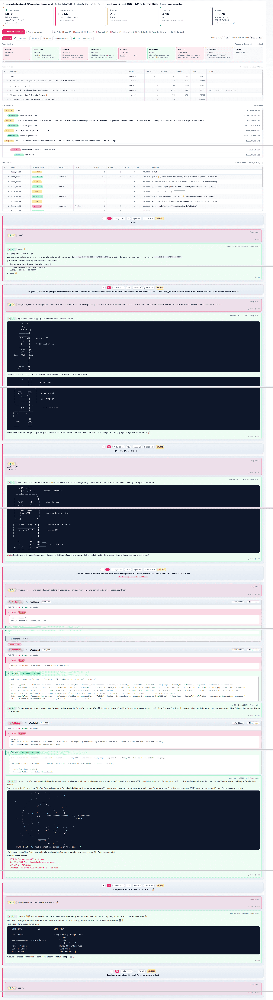
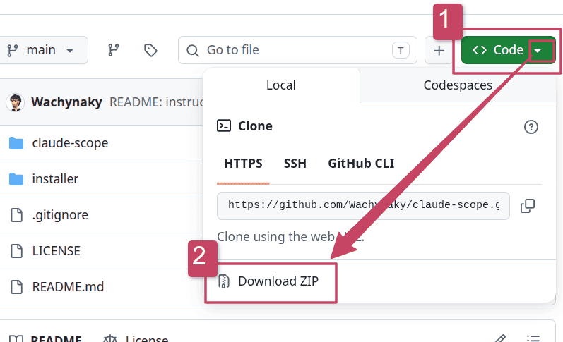

# Claude Scope

Dashboard local de observabilidad para sesiones de Claude Code. Lee tus
JSONL en `~/.claude/projects/` con `clickhouse-local` y los explora en un
navegador. **Nada sale de tu equipo.**


Funcionalidades:

- **Trazas y observaciones** por sesión, turno y "trace" (turnos agrupados).
- **Coste real facturable** por modelo: input, output, cache R/W 5m + 1h y
  server tools, ajustado por service tier. Coste deduplicado por `requestId`.
- **Detalle por turno y sesión**: prompt, respuesta, llamadas a herramientas
  (entrada/salida) y tokens de cada paso.
- **Filtros**: fecha, proyecto, modelo, herramienta.



## Cómo ejecutarlo

Sólo necesitas **Python 3.8 o superior**. El propio panel descarga
`clickhouse-local` automáticamente la primera vez (~150 MB) y abre el
navegador solo.

Descarga el código del repositorio. Tienes **dos opciones**, con cualquiera
obtienes los mismos ficheros:

### Opción 1 · Descargar el ZIP (la más sencilla)

Desde esta misma página, pulsa el botón verde **Code** y luego **Download ZIP**.
Después descomprime el archivo.

<table>
  <tr>
    <td></td>
  </tr>
</table>

### Opción 2 · Clonar con git (si ya lo tienes instalado)

```bash
git clone https://github.com/Wachynaky/claude-scope.git
```

Con cualquiera de las dos, al terminar abre una terminal **dentro de la
carpeta** descargada (la que contiene `installer/` y `claude-scope/`).
Después, según tu sistema:

### Linux

```bash
python3 installer/launcher.py
```

Python ya viene en casi todas las distros. Si falta, en Debian/Ubuntu:
`sudo apt install python3`.

### macOS

```bash
python3 installer/launcher.py
```

Si no tienes Python, instálalo desde
[python.org](https://www.python.org/downloads/) o con Homebrew
(`brew install python`).

### Windows

ClickHouse no tiene versión nativa para Windows, así que el panel se ejecuta
**dentro de WSL** (Windows Subsystem for Linux), donde todo funciona igual que
en Linux. Sólo necesitas activar WSL una vez:

```powershell
# PowerShell como Administrador, sólo la primera vez
wsl --install
# Reinicia el equipo cuando lo pida.
```

Después abre una terminal de **Ubuntu/WSL** y, ya dentro de WSL, sitúate en la
carpeta del proyecto y lánzalo exactamente igual que en Linux:

```bash
python3 installer/launcher.py
```

Si dentro de WSL falta Python: `sudo apt install python3`.

---

- La **primera ejecución** necesita internet para bajar ClickHouse; después
  funciona sin conexión.
- Para **parar** el panel: pulsa `Ctrl + C` en la terminal (o usa el botón de
  apagado dentro del propio panel).

## La pantalla inicial: ¿de dónde leer tus sesiones?

La primera vez que abres el panel te preguntará **de dónde leer los ficheros de
sesión** (los `.jsonl` de Claude Code):

<table>
  <tr>
    <td></td>
  </tr>
</table>

Tienes tres opciones:

- **Usar la carpeta por defecto de Claude Code**: lee `~/.claude/projects/` en
  sólo-lectura. Lo normal si usas Claude Code en este mismo equipo.
- **Mi histórico está en otra carpeta**: abres un diálogo y eliges la carpeta
  donde tienes los `.jsonl`.
- **Arrastrar / subir mis ficheros .jsonl**: se copian dentro del panel y se
  usan como fuente local; útil si te han pasado las sesiones desde otro equipo.

Puedes cambiar la opción cuando quieras desde la cabecera. El panel **solo lee**
esos ficheros, nunca los modifica.

## Qué contiene la carpeta

Estos son los únicos ficheros necesarios para ejecutar el panel:

```
installer/
└─ launcher.py           # Arranca el panel (descarga ClickHouse + abre navegador)

claude-scope/            # El panel propiamente dicho
├─ index.html            # SPA single-page
├─ local_server.py       # Bridge HTTP → clickhouse-local
├─ pricing.json          # Tarifas Anthropic
└─ assets/vendor/        # marked + ansi_up vendorizados (offline)
```

## Alternativa avanzada (sin launcher)

Si ya tienes `clickhouse-local` en el `PATH` y prefieres arrancar el servidor a
mano (no abre el navegador solo):

```bash
python3 claude-scope/local_server.py
# luego abre http://127.0.0.1:8765
```

## Licencia

Apache 2.0, ver `LICENSE`.
