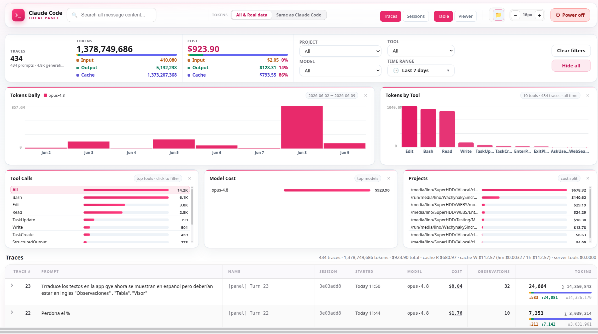
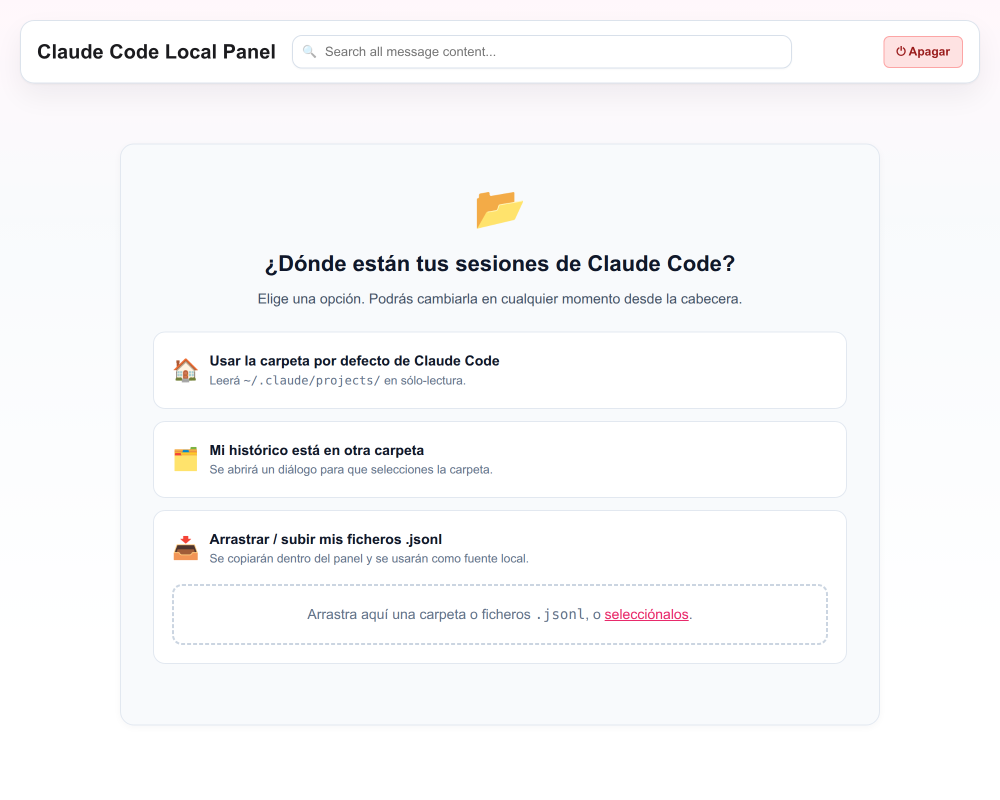
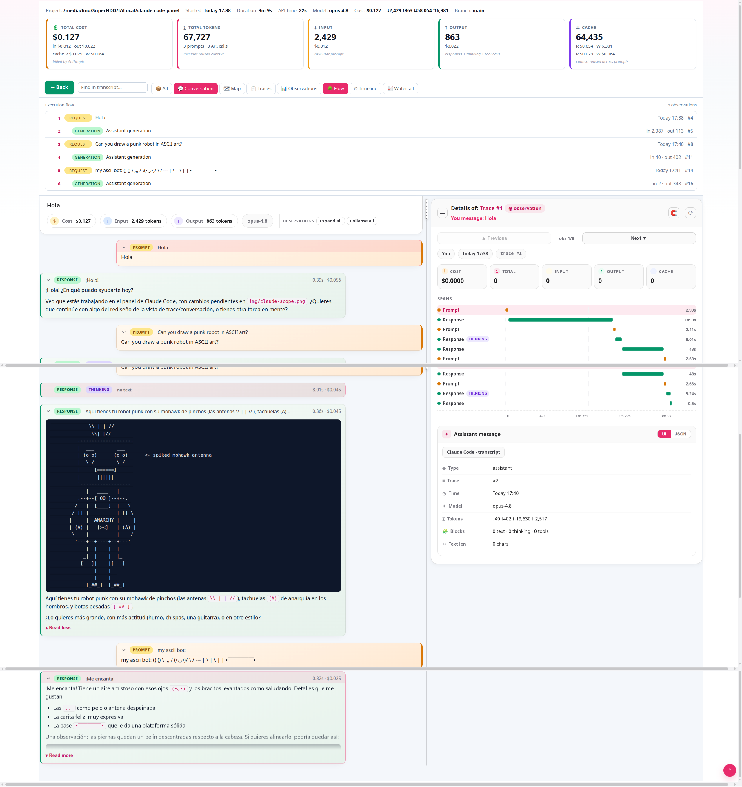

# Claude Scope



A local observability dashboard for Claude Code sessions. Claude Scope reads the JSONL files in `~/.claude/projects/`, analyzes them with embedded ClickHouse via [chdb](https://github.com/chdb-io/chdb), and lets you explore everything in your browser.

**Nothing leaves your machine.**

Features:

* **Traces and observations** grouped by session, turn, and trace.
* **Real billable cost** by model, including input, output, cache reads/writes, server tools, and service-tier adjustments. Costs are deduplicated by `requestId`.
* **Per-turn and per-session details**, including prompts, responses, tool calls, tool inputs/outputs, and token usage for each step.
* **Filters** by date, project, model, and tool.

> Want a preview? Jump to [The panel views](#the-panel-views) below.

## How to run it

You only need **Python 3.9 or newer**. Claude Scope uses [**chdb**](https://github.com/chdb-io/chdb), an embedded ClickHouse engine installed through `pip`: no separate binary, no server, and no extra configuration.

The dashboard opens automatically in your browser.

### Linux and macOS

Copy and paste this block into a terminal:

```bash
git clone https://github.com/Wachynaky/claude-scope.git
cd claude-scope
python3 -m venv .venv
source .venv/bin/activate
pip install -r requirements.txt
python3 app/local_server.py
```

That’s it. The dashboard opens at `http://127.0.0.1:8765`.

> The first time, `pip install` downloads chdb, which bundles the ClickHouse engine and may take a moment. After that, Claude Scope starts instantly and works offline.

If you don’t have Python installed:

On Debian/Ubuntu:

```bash
sudo apt install python3 python3-venv
```

On macOS, install Python from [python.org](https://www.python.org/downloads/) or with Homebrew:

```bash
brew install python
```

### Windows

chdb does not currently provide a native Windows build, so Claude Scope runs inside **WSL** (Windows Subsystem for Linux), where it works the same as on Linux.

Enable WSL once:

```powershell
# PowerShell as Administrator, first time only
wsl --install
# Reboot when prompted.
```

Then open an **Ubuntu/WSL** terminal and run the same commands as on Linux:

```bash
git clone https://github.com/Wachynaky/claude-scope.git
cd claude-scope
python3 -m venv .venv
source .venv/bin/activate
pip install -r requirements.txt
python3 app/local_server.py
```

If Python is missing inside WSL:

```bash
sudo apt install python3 python3-venv
```

Next time, once everything is already installed, just enter the folder and run:

```bash
source .venv/bin/activate
python3 app/local_server.py
```

To stop the dashboard, press `Ctrl + C` in the terminal, or use the power-off button inside the panel.

## The initial screen: choosing where to read sessions from

The first time you open Claude Scope, it asks where it should read Claude Code session files from. These are Claude Code’s `.jsonl` files.

<table>
  <tr>
    <td></td>
  </tr>
</table>

You have three options:

* **Use Claude Code’s default folder**: reads `~/.claude/projects/` in read-only mode. Choose this if you use Claude Code on this machine.
* **My history is in another folder**: opens a dialog so you can select the folder that contains your `.jsonl` files.
* **Drag / upload my .jsonl files**: copies the files into Claude Scope’s local data folder and uses them as the data source. This is useful when someone sends you sessions from another machine.

You can change the selected source at any time from the header. Claude Scope **only reads** these files; it never modifies them.

## What’s in the folder

These are the only files needed to run the dashboard:

```text
requirements.txt         # Dependency: chdb (embedded ClickHouse)

app/                     # The dashboard itself
├─ index.html            # Single-page app
├─ local_server.py       # HTTP server + chdb queries; opens the browser
├─ pricing.json          # Anthropic pricing
└─ assets/vendor/        # Vendored marked + ansi_up dependencies for offline use
```

## Startup options

`local_server.py` accepts a few parameters:

```bash
python3 app/local_server.py --port 9000   # Use another port; default is 8765
python3 app/local_server.py --no-open     # Do not open the browser automatically
```

## The panel views

### The dashboard


The dashboard is the main screen.

At the top, in the header, you’ll find:

* **Search**, to filter by message content.
* **Token mode**, a toggle on the right that changes how tokens are counted across all metrics:

  * **All & Real data**: input + output + cache, deduplicated per request. This reflects what you actually consume.
  * **Same as Claude Code**: raw input + output only, like the “Total tokens” shown in `/config` → Stats. This is usually higher because it does not deduplicate requests or account for cache behavior in the same way.
* **Data source**, showing the folder currently being read.
* **Panel zoom**, to adjust the interface scale.

Below the header, you choose how to group the data:

* **Group by trace**: the default view. Each session appears as a trace row, with all its turns nested below. This is the best view for walking through a full session.
* **Group by turn**: one row per prompt, useful for comparing individual turns.
* **Group by session**: one row per session, useful as a summary view.

You can also filter by **project, model, tool, and time range**, with a **Clear filters** option to reset everything.

The stats bar summarizes traces, tokens, total cost, API time, and permissions. Below it, charts show **daily tokens, tokens per tool, token mix, cost mix, cost per model, tool calls, MCP servers, and projects**.

### The conversation

Click a trace to open the session as a **chat**: System / You / Assistant bubbles, with the tokens and cost for each turn, plus rendered content such as Markdown, code blocks, and ASCII output.

Selecting a turn opens the **Details of invocation** panel on the right. It includes cards for cost, **total** tokens, input, and output, using the same colors as the session cards. It also shows a **spans** diagram of the invocation and its metadata.

The divider between the chat and the details panel is **draggable**, so you can widen whichever side you need.



Each **tool call** (WebSearch, WebFetch, Read, Bash, and others) can be expanded to inspect its **Input**, **Output**, and **Metadata** tabs, so you can see exactly what was sent and what came back.

## License

Apache 2.0. See `LICENSE`.
