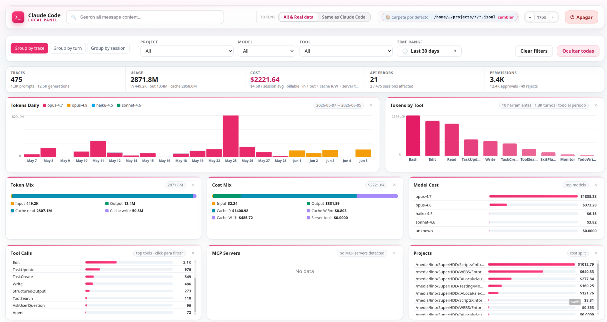
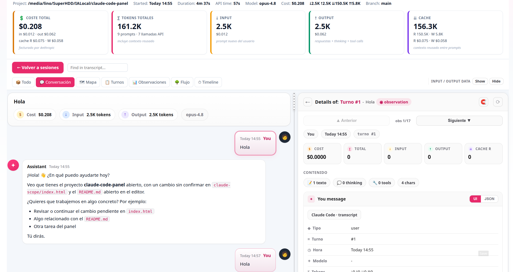

# Claude Scope

Dashboard local de observabilidad para sesiones de Claude Code. Lee tus
JSONL en `~/.claude/projects/` con ClickHouse embebido (chdb) y los explora en
un navegador. **Nada sale de tu equipo.**

Funcionalidades:

- **Trazas y observaciones** por sesión, turno y "trace" (turnos agrupados).
- **Coste real facturable** por modelo: input, output, cache R/W 5m + 1h y
  server tools, ajustado por service tier. Coste deduplicado por `requestId`.
- **Detalle por turno y sesión**: prompt, respuesta, llamadas a herramientas
  (entrada/salida) y tokens de cada paso.
- **Filtros**: fecha, proyecto, modelo, herramienta.

> ¿Prefieres ver primero qué pinta tiene? Salta a [Las vistas del panel](#las-vistas-del-panel) al final.

## Cómo ejecutarlo

Sólo necesitas **Python 3.9 o superior**. El motor de datos es
[**chdb**](https://github.com/chdb-io/chdb) (ClickHouse embebido), que se
instala con `pip`: no hay que descargar ningún binario ni configurar nada. El
panel abre el navegador solo.

### Linux y macOS

Copia y pega este bloque en una terminal:

```bash
git clone https://github.com/Wachynaky/claude-scope.git
cd claude-scope
python3 -m venv .venv
source .venv/bin/activate
pip install -r requirements.txt
python3 claude-scope/local_server.py
```

Eso es todo: se abre `http://127.0.0.1:8765` en tu navegador con el panel.

> La primera vez, `pip install` descarga chdb (incluye el motor de ClickHouse,
> tarda un poco). Después arranca al instante y funciona sin conexión.

Si no tienes Python: en Debian/Ubuntu `sudo apt install python3 python3-venv`;
en macOS instálalo desde [python.org](https://www.python.org/downloads/) o con
Homebrew (`brew install python`).

### Windows

chdb (ClickHouse) no tiene versión nativa para Windows, así que el panel se
ejecuta **dentro de WSL** (Windows Subsystem for Linux), donde todo funciona
igual que en Linux. Sólo necesitas activar WSL una vez:

```powershell
# PowerShell como Administrador, sólo la primera vez
wsl --install
# Reinicia el equipo cuando lo pida.
```

Después abre una terminal de **Ubuntu/WSL** y, ya dentro de WSL, copia y pega
exactamente el mismo bloque que en Linux:

```bash
git clone https://github.com/Wachynaky/claude-scope.git
cd claude-scope
python3 -m venv .venv
source .venv/bin/activate
pip install -r requirements.txt
python3 claude-scope/local_server.py
```

Si dentro de WSL falta Python: `sudo apt install python3 python3-venv`.

---

- Cuando vuelvas a usarlo (ya con todo instalado), basta con entrar en la
  carpeta y ejecutar:
  ```bash
  source .venv/bin/activate
  python3 claude-scope/local_server.py
  ```
- Para **parar** el panel: pulsa `Ctrl + C` en la terminal (o usa el botón de
  apagado dentro del propio panel).

## La pantalla inicial: ¿de dónde leer tus sesiones?

La primera vez que abres el panel te preguntará **de dónde leer los ficheros de
sesión** (los `.jsonl` de Claude Code):

<table>
  <tr>
    <td></td>
  </tr>
</table>

Tienes tres opciones:

- **Usar la carpeta por defecto de Claude Code**: lee `~/.claude/projects/` en
  sólo-lectura. Lo normal si usas Claude Code en este mismo equipo.
- **Mi histórico está en otra carpeta**: abres un diálogo y eliges la carpeta
  donde tienes los `.jsonl`.
- **Arrastrar / subir mis ficheros .jsonl**: se copian dentro del panel y se
  usan como fuente local; útil si te han pasado las sesiones desde otro equipo.

Puedes cambiar la opción cuando quieras desde la cabecera. El panel **solo lee**
esos ficheros, nunca los modifica.

## Qué contiene la carpeta

Estos son los únicos ficheros necesarios para ejecutar el panel:

```
requirements.txt         # Dependencia: chdb (ClickHouse embebido)

claude-scope/            # El panel propiamente dicho
├─ index.html            # SPA single-page
├─ local_server.py       # Servidor HTTP + consultas con chdb (abre el navegador)
├─ pricing.json          # Tarifas Anthropic
└─ assets/vendor/        # marked + ansi_up vendorizados (offline)
```

## Opciones de arranque

`local_server.py` acepta algunos parámetros:

```bash
python3 claude-scope/local_server.py --port 9000   # otro puerto (por defecto 8765)
python3 claude-scope/local_server.py --no-open      # no abrir el navegador solo
```

## Las vistas del panel

### El dashboard



Es la pantalla principal. Arriba del todo, en la cabecera:

- **Buscador** para filtrar por contenido de los mensajes.
- **Modo de tokens** (interruptor a la derecha), que cambia cómo se cuentan los
  tokens en todas las métricas:
  - **All & Real data**: input + output + cache, deduplicado por petición. Es lo
    que de verdad consumes.
  - **Same as Claude Code**: solo input + output en crudo, igual que el «Total
    tokens» de `/config` → Stats (suele dar más porque no deduplica ni cuenta cache).
- **Fuente de datos** (la carpeta que estás leyendo) y **zoom** del panel.

Justo debajo eliges **cómo agrupar** los datos:

- **Group by trace** (por defecto): cada sesión es una fila-traza con todos sus
  turnos anidados debajo. La mejor vista para recorrer una sesión completa.
- **Group by turn**: una fila por cada prompt (turno), para comparar turnos sueltos.
- **Group by session**: una fila por sesión, vista resumida.

Y filtras por **proyecto, modelo, herramienta y rango temporal** (con «Clear filters»
para reiniciarlos). La barra de stats resume traces, tokens, coste total, tiempo de
API y permisos, y más abajo hay gráficas de **tokens diarios, tokens por herramienta,
token mix (input/output/cache), cost mix, coste por modelo, llamadas a herramientas,
servidores MCP y proyectos**.

### La conversación

Haz clic en una traza para abrir la sesión como un **chat**: burbujas
System / You / Assistant con los tokens y el coste de cada turno, y el contenido
renderizado (markdown, bloques de código, ASCII…).

Al seleccionar un turno se abre a la derecha el panel **«Details of invocation»**,
con tarjetas de Coste, **Total** de tokens, Input y Output (mismos colores que las
tarjetas de sesión), un diagrama de **spans** de la invocación y todos sus metadatos. 
El separador entre el chat y el panel es **arrastrable**: tira de él para ensanchar
el lado que necesites en cada momento.



Cada **llamada a herramienta** (WebSearch, WebFetch, Read, Bash…) se despliega con sus pestañas **Input / Output / Metadata** para inspeccionar exactamente qué entró y
qué salió:

## Licencia

Apache 2.0, ver `LICENSE`.