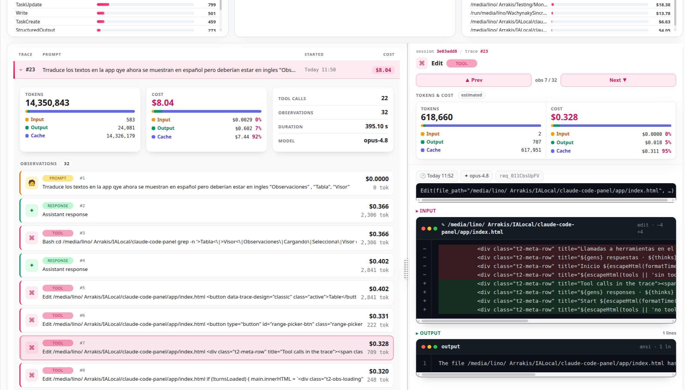

# Claude Scope


A local observability dashboard for Claude Code sessions. Claude Scope reads the JSONL files in `~/.claude/projects/`, analyzes them with embedded ClickHouse via [chdb](https://github.com/chdb-io/chdb), and lets you explore them in your browser.

**Nothing leaves your machine.** The one exception is optional and asked for up front: reading Anthropic's public pricing page so cost figures stay current. It downloads a public page and sends nothing about your sessions. See [Model pricing](#model-pricing).

Features:

* **Sessions, traces, and observations** (OpenTelemetry-aligned: session = conversation, trace = one interaction/prompt, observation = a span/step).
* **Billable cost** by model, including input, output, cache reads/writes, server tools, and service-tier adjustments. Costs are deduplicated by `requestId`.
* **Per-trace and per-session details**, including prompts, responses, tool calls, tool inputs/outputs, and token usage for each step.
* **Two layouts for the Traces table**: a classic table, and a viewer layout with an expandable metrics panel per trace and an observation viewer on the right.
* **Filters** by date, project, model, and tool.
* **Model pricing kept current**, read from Anthropic's published rate table, with a view listing every model and the exact rate applied to it.

> Want a preview? Jump to [The panel views](#the-panel-views) below.

## How to run it

You only need **Python 3.9 or newer**. Claude Scope uses [**chdb**](https://github.com/chdb-io/chdb), an embedded ClickHouse engine installed through `pip`: no separate binary, no server, and no extra configuration.

The dashboard opens automatically in your browser.

### Linux and macOS

Copy and paste this block into a terminal:

```bash
git clone https://github.com/Wachynaky/claude-scope.git
cd claude-scope
python3 -m venv .venv
source .venv/bin/activate
pip install -r requirements.txt
python3 app/local_server.py
```

That’s it. The dashboard opens at `http://127.0.0.1:8765`.

> The first time, `pip install` downloads chdb, which bundles the ClickHouse engine and may take a moment. After that, Claude Scope starts quickly and works offline.

If you don’t have Python installed:

On Debian/Ubuntu:

```bash
sudo apt install python3 python3-venv
```

On macOS, install Python from [python.org](https://www.python.org/downloads/) or with Homebrew:

```bash
brew install python
```

### Windows

chdb does not currently provide a native Windows build, so Claude Scope runs inside **WSL** (Windows Subsystem for Linux), where it works the same as on Linux.

Enable WSL once:

```powershell
# PowerShell as Administrator, first time only
wsl --install
# Reboot when prompted.
```

Then open an **Ubuntu/WSL** terminal and run the same commands as on Linux:

```bash
git clone https://github.com/Wachynaky/claude-scope.git
cd claude-scope
python3 -m venv .venv
source .venv/bin/activate
pip install -r requirements.txt
python3 app/local_server.py
```

If Python is missing inside WSL:

```bash
sudo apt install python3 python3-venv
```

Next time, once everything is already installed, just enter the folder and run:

```bash
source .venv/bin/activate
python3 app/local_server.py
```

To stop the dashboard, press `Ctrl + C` in the terminal, or use the power-off button inside the panel.

## The initial screen: choosing where to read sessions from

The first time you open Claude Scope, it asks where it should read Claude Code session files from. These are Claude Code’s `.jsonl` files.

<table>
  <tr>
    <td></td>
  </tr>
</table>

You have three options:

* **Use Claude Code’s default folder**: reads `~/.claude/projects/` in read-only mode. Choose this if you use Claude Code on this machine.
* **My history is in another folder**: opens a dialog so you can select the folder that contains your `.jsonl` files.
* **Drag / upload my .jsonl files**: copies the files into Claude Scope’s local data folder and uses them as the data source. This is useful when someone sends you sessions from another machine.

You can change the selected source at any time from the header. Claude Scope **only reads** these files; it never modifies them.

## What’s in the folder

These are the only files needed to run the dashboard:

```text
requirements.txt         # Dependency: chdb (embedded ClickHouse)

app/                     # The dashboard itself
├─ index.html            # Single-page app
├─ local_server.py       # HTTP server + chdb queries; opens the browser
├─ pricing_source.py     # Reads Anthropic's published pricing table (runs standalone too)
├─ pricing.json          # Anthropic pricing: per-model rates + tier fallback (updated in place)
└─ assets/vendor/        # Vendored marked + ansi_up dependencies for offline use
```

## Startup options

`local_server.py` accepts a few parameters:

```bash
python3 app/local_server.py --port 9000   # Use another port; default is 8765
python3 app/local_server.py --no-open     # Do not open the browser automatically
python3 app/local_server.py --view viewer # Open the Traces table in the viewer layout ("table" for the classic one)
```

## Model pricing

Costs are only as good as the rates behind them, and Anthropic publishes no pricing API. Claude Scope ships the rates in `app/pricing.json` and can refresh them from the ["Model pricing" table](https://platform.claude.com/docs/en/about-claude/pricing#model-pricing) of the public pricing page.

The first time you open the panel it asks how that should work. There are two answers, and neither reaches the network without you having said so:

* **Update manually**: the page is read only when you press **Update prices** in the pricing view.
* **Check on every start**: it is read when you open the panel, at most once a day, and if Anthropic changed a price the pricing view opens with the details.

Click the price tag button in the header to open the pricing view:

* Every model Claude Scope can price, with input, 5m and 1h cache writes, cache read and output rates.
* The models present in your loaded sessions are highlighted at the top with their real ids. A `listed` badge means the rate is published for that exact model; `tier` means it is not in the table and a coarse fallback tier is being used (a local Ollama model, for instance).
* **Last checked** shows when the official table was last read.
* **Update prices** reads it again; the button next to it switches between the two cadences above.

Rates live in `app/pricing.json`, inside the app itself, and nowhere else. The file that ships with Claude Scope is the same one an update rewrites, so there is a single place holding the prices: a download refreshes the `models` section and stamps `models_checked_at`, which is what **Last checked** shows after a reload. Nothing about pricing is written outside the app folder. A fresh download is at most one a day; if the page cannot be read, the stored rates stay in use and the view says so.

The rest of the file is yours to edit and is preserved on every update: server tool prices, the priority and batch multipliers, and the fallback tiers used for models the published table does not list.

The lookup is a standalone script, handy for checking rates without opening the panel:

```bash
python3 app/pricing_source.py            # print the current table
python3 app/pricing_source.py --force    # ignore the cache and download again
python3 app/pricing_source.py --json     # machine-readable
```

## The panel views

### The dashboard


The dashboard is the main screen.

At the top, in the header, you’ll find:

* **Search**, to filter by message content.
* **Token mode**, a toggle that changes how tokens are counted across all metrics:

  * **All & Real data**: input + output + cache, deduplicated per request. This reflects what you actually consume.
  * **Same as Claude Code**: raw input + output only, like the “Total tokens” shown in `/config` → Stats. This is usually higher because it does not deduplicate requests or account for cache behavior in the same way.
* **Grouping** (Traces / Sessions) and, for Traces, the **layout** toggle (Table / Viewer).
* **Data source**, a folder icon whose tooltip shows the folder currently being read; click it to change the source.
* **Panel zoom**, to adjust the interface scale.

Below the header, you choose how to group the data (aligned with OpenTelemetry tracing terminology, where a **trace** is a single interaction/prompt and a **session** is the whole conversation):

* **Traces**: the default view. One row per trace (a single prompt and everything the agent did to answer it). The **Table / Viewer** toggle in the header switches between two layouts:
  * **Table**: the classic table. Each row shows the **Name** (`[project] Turn N`, with the project derived automatically from the session path), token usage, **cost** (hover it for the input / output / cache breakdown), and the **number of observations** (spans/steps). Expand a row to see the trace's metric cards and its list of observations.
  * **Viewer**: the trace list on the left and an observation viewer on the right (described in [The Traces viewer](#the-traces-viewer)).
* **Sessions**: one row per session (conversation), with all its traces nested below, and the same cost breakdown on hover. Use this view to walk through a full session.

The stats bar summarizes **traces, tokens, and total cost** (with the input / output / cache breakdown), and holds the **filters**: project, model, tool, and time range, plus **Clear filters**.

Below it, charts show **daily tokens, tokens per tool, cost per model, tool calls, and projects**.

### The conversation

Click a row to open the session as a **chat**: System / You / Assistant bubbles, with the tokens and cost for each trace, plus rendered content such as Markdown, code blocks, and ASCII output.

Selecting a trace opens the **Trace details** panel on the right. It includes cards for cost, **total** tokens, input, output, and cache, using the same colors as the session cards. It also shows a **spans** diagram of the trace and its metadata.

The divider between the chat and the details panel is **draggable**, so you can widen whichever side you need.


Each **tool call** (WebSearch, WebFetch, Read, Bash, and others) can be expanded to inspect its **Input**, **Output**, and **Metadata** tabs, so you can see exactly what was sent and what came back.

### The Traces viewer

With the **Viewer** layout selected (header toggle or `--view viewer`), the Traces table splits into two columns.

On the left, each trace row (Trace #, prompt, start time, cost) expands to show:

* **Metric cards**: Tokens and Cost, each with the input / output / cache breakdown (Cost also shows each part's percentage), plus a card with Tool calls, Observations, Duration, and Model.
* The trace's **observations**, one row per step, marked by type (Prompt, Thinking, Tool, Response) with its tokens and cost.

Clicking an observation opens the **observation viewer** on the right (sticky and resizable; its width is remembered). It shows the observation's tokens and cost (estimated per observation) and its content, depending on the type:

* **Tool**: the invocation, plus the **Input** and **Output** in a code viewer.
* **Response**: the assistant message, rendered as Markdown.
* **Prompt**: the user message.
* **Thinking**: the reasoning text when present.

**Prev / Next** move between observations.



In the screenshot, trace #23 is expanded on the left — its Tokens and Cost cards, the Tool calls / Observations / Duration / Model card, and the observation list. On the right, the viewer shows an **Edit** observation with its tokens and cost, and its **Input** diff and **Output** in the code viewer.

## License

Apache 2.0. See `LICENSE`.
